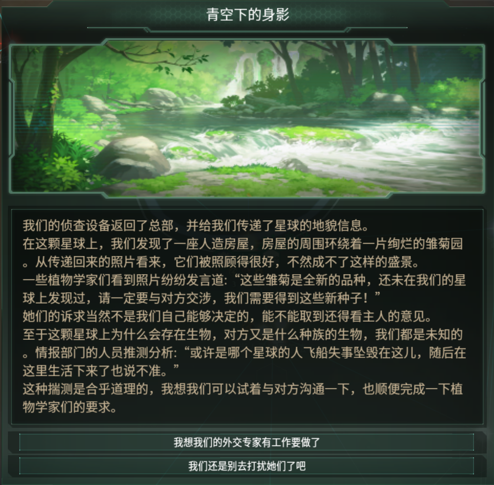

# 事件链

本 Mod 提供了很多独特的故事供游玩

## 领袖事件

> Leader Event

本mod关于领袖的事件较多，可以根据下表进行索引

| Leaders                            |
| ---------------------------------- |
| [青云天空](/Story?id=青云天空)     |
| [爱丽数码](/Story?id=爱丽数码)     |
| [优秀素质](/Story?id=优秀素质)     |
| [小栗帽](/Story?id=小栗帽)         |
| [爱丽速子](/Story?id=[爱丽速子]()) |
| [爱慕织姬](/Story?id=爱慕织姬)     |
| [东海帝王](/Story?id=东海帝王)     |
| [高尚骏逸](/Story?id=高尚骏逸)     |
| [里见光钻](/Story?id=里见光钻)     |
| [菱钻奇宝](/Story?id=菱钻奇宝)     |
| [玉藻十字](/Story?id=玉藻十字)     |
| [美妙姿势](/Story?id=美妙姿势)     |
| [夜色誓约](/Story?id=夜色誓约)     |
| [”K“](/Story?id=格鲁希)            |
| [卓芙](/Story?id=卓芙)             |
| [东商变革](/Story?id=东商变革)     |
| [真弓快车](/Story?id=真弓快车)  |

## 角色事件

| Character                      |
| ------------------------------ |
| [草上飞](/Story?id=草上飞)     |
| [无声铃鹿](/Story?id=无声铃鹿) |
| [万籁争鸣](/Story?id=万籁争鸣) |

## 其他事件

| Event                                        |
| -------------------------------------------- |
| [节食潮](/Story?id=节食潮)                   |
| [名次竞猜](/Story?id=名次竞猜)               |
| [马娘堕落帝国事件链](/Story?id=马娘堕落帝国) |
| [崛起的黄金家](/goldinvasion) |

## 事件流程

> 包含事件全流程，省略了一些仅推进故事进行，不会导致流程发生变化的事件步骤

### 青云天空

#### 触发条件

> 星系Bellis perennis有主人且政体为特雷森学院时触发

事件一：隐居者

| 选项             | 效果                    |
| ---------------- | ----------------------- |
| 赶快去调查一下！ | 继续事件                |
| 算了，别去管它   | 获得150影响力，结束事件 |

事件二：青空下的身影

| 选项                           | 效果                                   |
| ------------------------------ | -------------------------------------- |
| 我想我们的外交专家有工作要做了 | 发起特殊项目：和星球上的隐居者建立联系 |
| 我们还是别去打扰她们了吧       | 获得150影响力，结束事件                |

该特殊项目要求科学官等级至少为5，完成后接入和青云天空的通讯

关键选项：那么，你之后有什么打算？

| 选项                               | 效果                                                         |
| ---------------------------------- | ------------------------------------------------------------ |
| 星酱想来帮助我们管理我们的星球吗？ | 发起特殊项目：取花，花费10000社会学点数完成 后续获取的领袖为行政官 |
| 星酱能够帮我们来率领舰队吗？       | 发起特殊项目：取花 后续获取的领袖为指挥官                 |
| 那我们就不打扰星酱你了，后会有期~  | 结束事件                                                     |

特殊项目：取花完成后获得领袖青云天空并结束事件

青云天空初始等级为8，自带特质“青空浮云般的总督”（行政官版本）或特质“诡计之星”（指挥官版本）

### 爱丽数码

> 研究科技“建立训练员制度”后触发

事件一：Galgame？

获得修正“Koi Derby”，效果：幸福度+5%，人口增长速度+5%，持续20年

事件二：赛马娘热潮

| 选项                                 | 效果                    |
| ------------------------------------ | ----------------------- |
| 当赛马娘可不是什么简单事······       | 继续事件                |
| 总而言之是好事，就不浪费时间查了吧？ | 获得100影响力，结束事件 |

等待故事继续发生直到触发事件“续作”，获得修正“续作！”，效果：幸福度+5%，赛马娘岗位产出+20%，每月凝聚力+10%

继续故事进行，直到触发事件“爱丽数码的命运”

| 选项                                                         | 效果                    |
| ------------------------------------------------------------ | ----------------------- |
| 剥夺她的优先选拔权，但允许她在不影响准赛马娘的情况下进行取材 | 继续事件                |
| 这家伙该好好改改这毛病                                       | 获得200影响力，结束事件 |

继续故事进行，触发事件“选拔赛圆满结束！”，获得修正“选拔赛成功举行”，效果：赛马娘岗位产出+10%，持续20年

触发与爱丽数码的通讯

| 选项                                                   | 效果                                                         |
| ------------------------------------------------------ | ------------------------------------------------------------ |
| 这款游戏在民间影响很大，我们需要对其内容进行审核与监管 | 获得修正“受到监管的KD”，效果： 赛马娘岗位维护费-10% 幸福度+5% 人口增长速度+5% 持续40年 结束事件 |
| 中央特雷森招生办主任，这个职位如何？                   | 继续事件                                                     |

触发事件“爱众生”

获得领袖爱丽数码

获得修正“我们的数码主任”，效果：赛马娘岗位产出+30%，赛马娘岗位维护费+10%，幸福度+10%，人口增长速度+10%

两个选项之一将会发生：

“游戏沉迷？”事件将在2年和20天到2年和40天后触发；

获得1影响力

爱丽数码固定为行政官，初始等级为7，自带特质“DD头子”

### 优秀素质

> 研究科技“基础因子图谱归纳”并举行三次国家级比赛后触发

事件一：事不过“三”

| 选项                             | 效果                    |
| -------------------------------- | ----------------------- |
| 哦？让我们见见这位“三着女士”     | 继续事件                |
| 不必了，不过可以借此好好宣传一下 | 获得200影响力，结束事件 |

接入和优秀素质的通讯，发起特殊项目：检查优秀素质的身体

完成特殊项目后接入和优秀素质的通讯，发起特殊项目：优秀素质身上的谜团

完成特殊项目后接入和优秀素质？的通讯

获得修正“内恰的知识”，效果：岗位产出的资源+3.30%，幸福度+3.3%，人口增长速度+3.3%，舰船武器伤害+3%，舰船武器射速+3%，超光速速度+3%，舰船武器射程+3%

解锁建筑：内恰的居酒屋

解锁和优秀素质的通讯

获得博物天枢收藏：内恰的情人节礼物

如果拥有科技“克隆”即可以在和优秀素质的通讯中让优秀素质成为一名领袖，同时最多拥有三名类型互不相同的内恰领袖

优秀素质初始等级为5，自带特质随领袖类型变化

指挥官时自带特质“RUN&WIN”

行政官时自带特质“八方睥睨”

科学官时自带特质“RUN&WIN”

### 小栗帽

> 开局约700天触发

事件一：食物失窃

| 选项                       | 效果               |
| -------------------------- | ------------------ |
| 不能再忍了，必须要出重拳！ | 食物-100，继续事件 |
| 就少了点食物嘛，平平无奇   | 食物-100，结束事件 |

事件二：逮捕！

| 选项                                         | 效果                                       |
| -------------------------------------------- | ------------------------------------------ |
| 感觉这位马娘不是一般人，让其加入我们         | 获得领袖小栗帽                             |
| 此外，我们还得补贴一下国内的自助餐厅         | 获得领袖小栗帽； 获得修正“补贴自助餐厅” |
| 但她似乎不能很好地照顾自己，还是送她回老家吧 | 什么都没有                                 |

补贴自助餐厅效果：幸福度+5%，人口增长速度+5%，每月能量币-5%

小栗帽固定为行政官，初始等级为4，自带特质“芦毛灰姑娘”

### 爱丽速子

> 进入星系艾格尼丝触发

事件一：一艘非官方的民用飞船

发起特殊项目：与飞船上的人建立联系

完成特殊项目后触发事件二

事件二：云游夫妻

| 选项                     | 效果                                             |
| ------------------------ | ------------------------------------------------ |
| 接入通讯                 | 接入和曼城茶座的通讯                             |
| 慢着，我想多一些了解她们 | 触发一段爱丽速子和曼城茶座的故事，不影响事件进行 |

通讯关键选项：好吧，现在让我们来谈谈你们

| 选项                                 | 效果                                                         |
| ------------------------------------ | ------------------------------------------------------------ |
| 我们会许可你们非官方的勘测行为       | 继续事件，生成考古遗迹                                       |
| 我们会没收你们的飞船，并将你们送回去 | 随机触发下列效果之一： 二人驾驶飞船逃走，结束事件； 同意回收飞船，继续事件并生成考古遗迹 |

完成考古遗迹：废弃空间研究站遗迹

完成考古后接入和爱丽速子的通讯，之后生成特殊项目：调查前文明星球首府所在地

完成特殊项目后生成考古遗迹：联合学院遗迹，完成考古后触发事件三

事件三：回收“导师”程序

| 选项                       | 效果                                                         |
| -------------------------- | ------------------------------------------------------------ |
| 程序被爱丽速子得到         | 接入和爱丽速子的通讯，发现遗珍：速子改良版“导师”程序         |
| 程序被曼城茶座得到         | ”导师“程序被曼城茶座毁掉                                     |
| 记录官向两人开枪并夺走程序 | 概率触发下列效果之一： 触发事件“记录官被二人击倒！” 触发事件”两人被击倒！“，发现遗珍：完整的"导师"程序 |

程序被爱丽速子或曼城茶座得到均可以继续事件

如果开枪，无论有没有抢到程序均会获得修正“针对政府的阴谋集团”并结束事件

修正效果：稳定度-10，犯罪度+7%，幸福度-7%，持续10年

等待一段时间后触发后续事件

| 选项                                 | 效果                                                         |
| ------------------------------------ | ------------------------------------------------------------ |
| 我希望你重新回来做我们的科学家       | 触发后续事件，获得领袖爱丽速子，博物天枢样本“爱丽速子的药”，94影响力和修正“曼城茶座领导的外交部”并结束事件 |
| 没什么事，我只是想说，祝你们一路顺风 | 结束事件                                                     |

爱丽速子固定为科学官，初始等级为8，自带特质“超光速的公主”

修正效果：外交权重+30%

### 爱慕织姬

> 建立三女神纪念馆400到540天后触发

事件一：虚假的星空？

| 选项                         | 效果                    |
| ---------------------------- | ----------------------- |
| 真是天马行空的想象，随她去吧 | 获得200影响力，结束事件 |
| 有趣，她叫什么名字？         | 继续事件                |

事件二：天赋异禀Ⅰ

| 选项                               | 效果     |
| ---------------------------------- | -------- |
| 问问她愿不愿意去天文学部门当助理？ | 继续事件 |
| 唔，看来我们的国民科学素养都挺高的 | 结束事件 |

事件三：天赋异禀Ⅱ

| 选项                                                     | 效果                               |
| -------------------------------------------------------- | ---------------------------------- |
| 探索未知的宇宙是危险的，这种不可多得的人才应该留在学院里 | 获得1000点工程学研究点数，结束事件 |
| 那我们就满足她的小愿望吧                                 | 获得领袖爱慕织姬                   |

爱慕织姬固定为科学官，初始等级为2，自带特质“夜之拂晓，空之瑞星”

选择飞升“全身全灵”或“摘星”后触发后续事件

接入和爱慕织姬的通讯

| 选项                     | 效果                                       |
| ------------------------ | ------------------------------------------ |
| 那好吧，我们尊重你的选择 | 发起特殊项目：观星                         |
| 科学研究同样是最前沿哦？ | 特质“夜之拂晓，空之瑞星”效果变化，结束事件 |

完成特殊项目后生成考古遗迹：星星的注视下

完成考古后，事件“试炼”将在20到26天后触发，之后发起特殊项目：翻译

完成翻译后触发事件“翻译完成”，之后发起特殊项目：设备解析

完成设备解析后获得科技进展：领域稳定装置、领域能附着、因子推演、因子调率器

研究科技因子推演后触发事件”可能性的未来”

| 选项                                                       | 效果                                                         | 条件                               |
| ---------------------------------------------------------- | ------------------------------------------------------------ | ---------------------------------- |
| 马娘们应该有自由选择是否使用它的权力                       | 获得修正“天赋仪的运用”，效果： 岗位产出的资源+20% “檄文”事件在80到90天后触发 | 无                                 |
| 以体检的名义使用它，只要人们不知道，那就不存在             | 2个选项之一将会发生： 概率获得修正“天赋仪的运用”，效果： 岗位产出的资源+20% 概率无效果； 获得修正“天赋仪的运用”，效果： 岗位产出的资源+20% “檄文”事件触发 | 无                                 |
| 这是个潘多拉的魔盒，把它封进档案室                         | 获得300影响力                                                | 无                                 |
| 这是全马娘的福祉，它将帮助我们纵横星海                     | 获得修正“天赋仪的运用”，效果： 岗位产出的资源+30% 犯罪度+15 幸福度-10% 稳定度-10 | 具有威权主义思潮或极端威权主义思潮 |
| 马娘的天赋和能力是不被束缚的，这个仪器无法计算心灵的力量   | 获得270影响力和300凝聚力                                     | 具有唯心主义思潮或极端唯心主义思潮 |
| 我们可以通过它认识到自己的局限性，但社会层面的问题需要关注 | 获得修正“天赋仪的运用”，效果： 岗位产出的资源+25% 稳定度-10 | 具有唯物主义思潮或极端唯物主义思潮 |
| 这种仪器不会对我们平等的社会产生任何负面影响               | 获得修正“天赋仪的运用”，效果： 岗位产出的资源+20%        | 具有平等主义思潮或极端平等主义思潮 |

| 选项                                                         | 效果                                                         |
| ------------------------------------------------------------ | ------------------------------------------------------------ |
| 她说的有道理，重新商议天赋仪的使用                           | 花费300影响力，移除修正“天赋仪的运用                         |
| 禁止任何组织将天赋仪的数据作为标准                           | 获得修正”我们对天赋仪的态度“，效果： 稳定度-12 幸福度-1000% 犯罪度+10 |
| 发布公告，天赋仪的数据是国家绝密，仅供国家寻找人才使用，不会影响大多数人的生活 | 获得修正”我们对天赋仪的态度“，效果： 岗位产出的资源+12% 稳定度-10 |
| 找人写篇文章反驳，就写马娘们应该承认自己的局限性，再感叹下有多少天才埋没在旧式的教育体系下 | 获得修正”我们对天赋仪的态度“，效果： 稳定度-15 威权主义思潮吸引力+50% |

### 东海帝王

>完成异常现象“逆飞的气态巨星”触发，该异常会在1-5跳内拥有气态巨行星星系内的气态巨行星上生成

完成后生成特殊项目：研究甜味固体

完成特殊项目后获得1820消费品，事件“糖海之下”在150到175天后触发

事件“糖海之下”触发后发起特殊项目：调查异常读数，该特殊项目要求科学官等级至少为5，完成特殊项目后生成考古遗迹：炙热糖浆海

完成考古后发起特殊项目：建造解冻装置

完成特殊项目并等待一段时间后触发后续事件，收养幼年东海帝王，获得修正“甜甜的”，效果：幸福度+10%，领袖经验获得+10%，持续5年

等待一段时间后触发事件“戒断？”

获得修正”糖醇戒断“，效果：幸福度-5%，岗位产出的能量币-5%，移除修正“甜甜的”

随故事进行触发事件“浓点稠点”

获得修正“浓点稠点”，效果：幸福度+10%，领袖经验获得+10%，岗位产出的凝聚力+10%，移除修正“糖醇戒断”

此后将开始一系列东海帝王的养成事件

以上七个事件的选择将影响帝王最终的领袖类型

若选择选项1的次数大于等于4，则最后获得的帝王为行政官；

若选择选项1的次数大于等于4，则最后获得的帝王为指挥官；

若选择选项1的次数大于等于4，则最后获得的帝王为科学官；

若以上条件均不满足，则最后获得的帝王职业为随机决定

之后线性等待故事继续进行即可结束事件并获得领袖东海帝王

东海帝王初始等级为2，自带特质随领袖类型变化

指挥官时自带特质“帝王舞步”和“不屈的心”

行政官时自带特质“帝王”和“八千三狂热”

科学官时自带特质“星海帝王”和“星海彼端的灵光”

### 高尚骏逸

> 完成星界裂隙“天外世界”触发，该裂隙会在1-9跳内星系随机生成

由于该裂隙流程较为线性且结束探索选项非常明显（直接叫结束吧），故不列出流程。完成裂隙探索后即可获得领袖高尚俊逸

高尚俊逸固定为行政官，初始等级为2，自带特质“伟大的马娘”和“社恐”

> 兄弟，兄弟，我喜欢你

### 里见光钻

> 大约在开局1900日触发

事件一：山珍海味？

继续事件直到触发“特调酱料”

| 选项                                | 效果                                                         |
| ----------------------------------- | ------------------------------------------------------------ |
| 这两种配方画风好像不太一样啊······· | 触发事件“调查”                                               |
| 这似乎可以让我们的马娘们多吃点      | 随机触发下列效果之一： 事件“发胖危机”在200天后触发； 获得修正“食欲大开”，效果： 岗位产出的资源+4% 人口食物消耗+4% 事件“调查”在50天后触发 |

发胖危机

获得修正“发胖”

效果：人口住房使用+5%，人口食物消耗+4%，幸福度+4%，亚光速航速-2%

事件“调查”在100天后触发

| 选项                                                         | 效果                   |
| ------------------------------------------------------------ | ---------------------- |
| 我看你们调查部才是不务正业，这么闲的话要不去新殖民地报道吧！ | 获得20影响力，结束事件 |
| 或许可以从这个角度刺激新商品的消费？                         | 继续事件               |

调查Ⅱ

| 选项                                 | 效果                             |
| ------------------------------------ | -------------------------------- |
| 真是有趣                             | 在通讯中解锁”里见光钻“，结束事件 |
| 或许我们可以帮忙缓和他们家族间的关系 | 触发事件“学生会干预”             |

| 选项                           | 效果                             |
| ------------------------------ | -------------------------------- |
| 让光钻做她想做的事吧           | 在通讯中解锁“里见光钻”，结束事件 |
| 我们会帮助光钻走到正确的道路上 | 触发事件“小型会谈”               |
| 我们需要调和两边               | 结束事件                         |

| 选项                       | 效果·                                      |
| -------------------------- | ------------------------------------------ |
| 去继承家产也不是不好       | 事件“来自里见家族的感谢”在100到105天后触发 |
| 继续去深造比这个有意思多了 | 事件“启程的列车”在100到105天后触发         |

“来自里见家族的感谢”效果：

获得10000能量币

获得修正“里见家族的资助‘，效果为每月能量币+6

“启程的列车”效果”：

事件“学成归来”在5年200天到5年250天后触发，最后会获得领袖里见光钻

里见光钻固定为科学官，初始等级为5，自带特质“璀璨的钻石”

若解锁和里见光钻的通讯，则可使用“里见厨房”

### 菱钻奇宝

> 调查1-5跳内的海洋星球触发

事件一：普通的 星球

| 选项                                         | 效果                                   |
| -------------------------------------------- | -------------------------------------- |
| 既然调查人员都这么说了就派人进行详细的调查吧 | -1000能量币，发起特殊项目：普通的 星球 |
| 这么普通的星球不值得我们浪费资源             | 获得20影响力，结束事件                 |

特殊项目普通的 星球完成后触发事件二

事件二：双子岛

| 选项                           | 效果                        |
| ------------------------------ | --------------------------- |
| 有趣，批准进入轨道内调查       | -1000能量币，触发事件“发现” |
| 两座岛而已，没什么调查的必要了 | 结束事件                    |

事件“发现”触发后发起特殊项目：（国家名称）救援，完成后触发事件三

事件三：saving Private Umamusume

| 选项                           | 效果                    |
| ------------------------------ | ----------------------- |
| 调出影像，询问她究竟发生了什么 | 接入和菱钻奇宝的通讯    |
| 这种事情还是先搁置一下吧       | 首都增加1人口，结束事件 |

| 选项                                       | 效果                                                     |
| ------------------------------------------ | -------------------------------------------------------- |
| 你的训练员我们帮你去解释，我们现在很需要你 | 获得领袖菱钻奇宝（青春版）                               |
| 好吧，那等你准备好了就请来找我们           | 等待约三年后触发后续事件，最后获得领袖菱钻奇宝（完全体） |

菱钻奇宝固定为科学家，初始等级为2，自带特质“平凡有时亦是奇迹”和“摸鱼”

青春版菱钻奇宝不具有特质“平凡有时亦是奇迹”

获得菱钻奇宝一段时间后触发事件“摸！”，之后触发事件“小插曲”

| 选项                                 | 效果                        |
| ------------------------------------ | --------------------------- |
| 下不为例                             | 无                          |
| 菱钻奇宝同学，我们遗憾的通知你······ | 男人，什么罐头我说？奇宝out |

结束事件

> 我嘞个飞柱

### 玉藻十字

> 击杀星神兽：噬星者后触发

事件一：噬星者能量下降

发起特殊项目：进一步探索贫瘠星球

完成项目后科研船会被锁定，并生成考古遗迹：狼藉

完成考古后触发事件“利维坦内的文明”

三个选项的效果相同，之后触发事件“恢复通信？”，发起特殊项目：建立量子通信隧道

完成特殊项目后接入和“玉藻绮罗”的通讯

关键选项：你们的科研状况如何？可以选择是否花费资源购买科研buff

失去2000能量币，2000食物，1000合金，获得修正“锦野数据库”，效果：研究速度+20%，持续5年

5年后可再次触发该事件并购买buff

购买两次buff后获得领袖玉藻十字

玉藻十字固定为行政官，初始等级为5，自带特质“白色稻妻”和“给锦野的援助”

### 美妙姿势

> 第一次进行第一次接触事件后触发

接入和美妙姿势的通讯

获得领袖美妙姿势（不可能有人选真不熟吧）

美妙姿势固定为行政官，初始等级为2，自带特质“爱尔兰之花”

往后推进故事需要完成三个条件，分别为：

完成一次考古

完成一次政府改革

研究战列舰科技

完成一次考古后会接入和美妙姿势的通讯，发起特殊项目：失落的精灵科技，完成特殊项目概率获得修正“失落的精灵科技”，效果为岗位产出的资源+10%

完成一次政府改革后会接入和美妙姿势的通讯，获得修正“皇家之星”，效果：研究速度+5%，每月凝聚力+10%

研究战列舰后会接入和美妙姿势的通讯，可选择获得修正“茉莉安之矛”，效果：舰船建造速度+15%

三个条件均完成后等待一段时间后触发事件“拉面狂潮”

| 选项     | 效果                                       |
| -------- | ------------------------------------------ |
| 查明真相 | 发起特殊项目：寻找“真凶”                   |
| 放着不管 | 等待一段时候后，领袖美妙姿势消失并结束事件 |
| 毫无兴趣 | 等待一段时候后，领袖美妙姿势消失并结束事件 |

特殊项目完成后获得修正“拉面公主”，效果：贸易额+20%

继续进行事件直到第二次接入和美妙姿势的通讯

| 选项             | 效果                                                         |
| ---------------- | ------------------------------------------------------------ |
| 只是一场噩梦而已 | 发起特殊项目：失踪的皇女 完成特殊项目后效果与选项二一致   |
| 别怕，我在这里   | 添加修正“天幕陨落”，效果： 岗位产出的资源-30% 舰船建造速度+100% 失去领袖美妙姿势 失去所有和美妙姿势相关的修正 在首都星系生成一支敌方舰队 稍候生成一支弱一些的友方舰队 |

击败敌方舰队后发起特殊项目：残骸

研究特殊项目后生成星系Lost Utopia及考古遗迹Earrach siog

完成考古后触发事件“美妙姿势”，获得所有与美妙姿势有关的修正

行星Elf Beannaigh获得修正“精灵之泉”，效果：岗位产出的资源-100%，岗位产出的凝聚力+150%

殖民该行星即可重新获得领袖美妙姿势

美妙姿势固定为行政官，初始等级2，自带特质“精灵加护”和“爱尔兰之花”

### 夜色誓约

> 通过进行遗落特雷森的一般访问触发

第一次完成访问后获得修正“遗落特雷森的竞走比赛”，效果：赛马娘岗位产出+10%，幸福度+5%

获得修正“遗落特雷森的管理经验”，效果：领袖维护费-25%，岗位所需的维护费-5%

触发事件“离去”，获得一些资源

第二次访问后获得一些资源

第三次完成访问后发起特殊项目：协助管理人员培训

完成特殊项目后获得修正“夜色誓约的礼物”，效果：岗位产出的资源+20%，幸福度+3%，舰船武器射速+10%，舰船武器伤害+20%，舰船武器射程+10%，人口产生的帝国规模-10%，持续20年

第四次完成访问后发起特殊项目：挑选马娘

完成特殊项目后继续事件，最后获得修正“希望的继承者”，效果：研究速度+10%，岗位产出的资源+8%，持续5年

5年后触发事件“交流结束“

获得领袖夜色誓约（应该不会有人选让她回去建设家乡吧）

夜色誓约固定为行政官，初始等级为5，自带特质“暗夜新星”

### “K”

> 通过事件链“旧文明”获得，该事件链通过研究异常现象“钢铁丛林”触发，会在1-9跳内的陆地星球或盖亚星球上随机生成，生成该异常现象的星系固定出现敌对舰队“远古守护者”

事件一：失踪

锁定科研船，十天后触发事件“失踪Ⅱ”

失踪Ⅱ三个选项不影响事件进行，之后触发事件“回归”

| 选项                                                         | 效果                                                    |
| ------------------------------------------------------------ | ------------------------------------------------------- |
| 真是令人振奋的消息，派出考古队！                             | 将行星类型变为机械星球； 生成考古遗迹：钢铁丛林之下  |
| 没事就好，不过，派出救援队花的钱或许可以记在（被救科学家名称）的工资单上？ | 将行星类型变为机械星球； 生成考古遗迹：钢铁丛林之下 |
| 可我还是想把这些藤蔓炸了                                     | 发起特殊项目：炸毁藤蔓                                  |

完成特殊项目：炸毁藤蔓后星球类型变成死寂星球并结束事件

特殊项目：安装炸药完成后会摧毁发掘过该考古遗迹的科研船并结束事件

考古过程

| 选项                         | 效果                     |
| ---------------------------- | ------------------------ |
| 从蒂斯普特的数据库中找找线索 | 发起特殊项目：分析数据库 |
| 让全国的专家一起帮忙         | 发起特殊项目：解码总动员 |
| 安装炸药                     | 发起特殊项目：安装炸药   |

分析数据库和解码总动员均能推进故事进行，安装炸药则会摧毁考古遗迹和科研船并结束事件

考古完成后发起特殊项目：分析地下室文档，之后触发事件

| 选项                     | 效果                    |
| ------------------------ | ----------------------- |
| 向真理前进！             | 唯物主义思潮吸引力+100% |
| 三女神将引领我们的步伐！ | 唯心主义思潮吸引力+100% |
| 向先驱者们致敬           | 无                      |

结束旧文明事件链第一部分

选择飞升“全身全灵”和“摘星”后开始旧文明事件链第二部分

| 选项                             | 效果                                                    |
| -------------------------------- | ------------------------------------------------------- |
| 派出三个搭载跃迁引擎的无人探测器 | 生成星系蒂斯普特，获得200合金，获得蒂斯普特的低等级情报 |
| 舰队折跃！                       | 生成星系蒂斯普特                                        |

星系内固定生成异常现象“植物天堂”

研究异常现象后生成考古遗迹：花草秘境

考古过程中获得修正“热带考虫！”，效果：幸福度+6%；获得4000食物

完成考古后触发事件“竹篮打水”

| 选项                 | 效果                     |
| -------------------- | ------------------------ |
| 这是浪费资源，翻篇吧 | 结束事件                 |
| 无所谓，经费够       | 失去4000能量币，继续事件 |

继续事件进行，直到触发和？？？的通讯

| 选项           | 效果                             |
| -------------- | -------------------------------- |
| 先告诉我你是谁 | 触发第二次选项                   |
| 可以           | 失去200能量币和400合金，继续事件 |

| 选项                           | 效果                     |
| ------------------------------ | ------------------------ |
| 你只是一堆数据，是你有求于我吗 | 结束事件                 |
| 好吧，但这之后我们得好好沟通   | 和之前“可以”选项效果相同 |

继续进行事件，直到接入和“K”的通讯

关键选项：大体上没什么想问的了

触发事件“旧瓶装新酒”

| 选项                                       | 效果                                                         |
| ------------------------------------------ | ------------------------------------------------------------ |
| 不应该让她主导我们的研究                   | 发起特殊项目：建设纳米机械细胞生产线                         |
| 为她定制一副躯体，躯体按照她的数据构建     | 发起特殊项目：为K建造一副躯体                                |
| 为她定制一副躯体，或许可以跟她开个小玩笑？ | 发起特殊项目：为K建造一副躯体（该选项会让最后获得的领袖立绘变为马娘版 |

两个特殊项目效果一致，完成后获得修正“腾飞的工业”，效果：舰船建造速度+30%，行星建造速度+30%，获得领袖（可选择名字，此处默认为格鲁希）

格鲁希固定为科学官，初始等级为10，自带特质“久远的回忆”

结束事件链旧文明第二部分

随时间继续进行事件，触发事件“前路”

| 选项             | 效果     |
| ---------------- | -------- |
| 让波旁去和她谈谈 | 继续事件 |
| 顺其自然         | 结束事件 |

触发事件“意料之外的发展”

| 选项                                                         | 效果                                                         |
| ------------------------------------------------------------ | ------------------------------------------------------------ |
| 唔，还是让她们专注于学习为好，我们需要这样的人才             | 触发事件“各司其职”， 获得修正“殖民星球互助会”，效果： 殖民地发展速度+50%，星球人口<10时，幸福度+10%，人口生长速度+15%；星球人口>10时，全岗位产出+5% |
| 什么人才不是人才呢？不要过多在意过去的事，她们也只是特雷森马娘的一员而已 | 触发事件“各司其职”， 获得修正“殖民星球互助会”，效果： 殖民地发展速度+50%，星球人口<10时，幸福度+10%，人口生长速度+15%；星球人口>10时，全岗位产出+5% 获得修正“天才机械师”，效果： 研究速度（工程学）+10% 行星建造速度+9% 舰船建造速度+9% 船体值+10% 护盾承受值+10% |

### 卓芙

> 获得领袖格鲁希后触发事件

事件一：C·O·N·T·A·C·T

| 选项                                         | 效果             |
| -------------------------------------------- | ---------------- |
| 不可以                                       | 绝情啊，结束事件 |
| 没什么大不了的，批准，但是要去看看她发的什么 | 继续事件         |

继续事件进行直到触发“天降”，获得修正“小洋马”，效果：岗位产出的社会学研究+5%

等待一段时间后触发事件“幽灵船”，发起特殊项目：小心造访

完成特殊项目后只需线性推进故事完成即可获取领袖卓芙

卓芙固定为科学官，初始等级为6，自带特质“我也是灰姑娘” “冲破穹顶” “邋遢大小姐”

呜哇，有人发癫惹

### 东商变革

> 大约在开局1580日触发

事件一：神秘论坛

| 选项                             | 效果     |
| -------------------------------- | -------- |
| 去调查一下这个论坛是什么来头     | 继续事件 |
| 这种论坛有什么稀奇的，这也要查？ | 结束事件 |

事件二：神秘论坛Ⅱ

| 选项                                                       | 效果     |
| ---------------------------------------------------------- | -------- |
| 这些帖子写的内容真有意思，问问她这些写作素材都是从哪儿来的 | 继续事件 |
| 看来特雷森学院真是人才济济                                 | 结束事件 |

接入和东商变革的通讯，之后会连续生成三个考古遗迹，分别为发烧的楼道、天降蓝冰、变种萝卜。

完成三个考古遗迹后再次触发和东商变革的通讯，之后只需要线性等待事件继续进行即可结束事件，获得领袖东商变革和博物天枢样本sweepy的扫帚

东商变革固定为科学官，初始等级为4，自带特质“见习魔法少女”

### 真弓快车

> 真弓快车的事件分为开局携带麻酱的国民理念和不携带麻酱的国民理念两种情况

若游戏开始时携带有麻酱的国民理念，则开局10天后触发事件“麻酱的私房钱”

获得500能量币、100消费品以及领袖真弓快车

真弓快车固定为行政官，初始等级为5，自带特质“焰火”

开局20年后触发事件“潮声渐起”

90天后，触发事件“...被遗忘”

失去领袖真弓快车

注意：由于作者的仁慈，领袖真弓快车只是转移到了默认的空帝国里，因此如果不主动下掉麻酱的话麻酱仍然可以管理她之前所在的星球，即使麻酱并不在领袖列表里面

10天后触发事件“我们究竟忘记了什么”

发起特殊项目：寻找我们失去的东西

该特殊项目进行事件很长（7200天），选择飞升天赋“心象”将有助于该特殊项目进行

完成特殊项目后触发事件“她的名字是...麻酱！”

发起特殊项目：定位麻酱的位置，完成后触发事件“一个未知的星系”

在首都旁生成星系Flare

研究星系内异常现象“于故事结束的那片海”，研究完成后触发同名事件

获得领袖真弓快车

真弓快车固定为行政官，初始等级为5极+20000领袖经验（基础值），自带特质“Flare”和“永不遗忘”

如果游戏开始时未携带麻酱的国民理念，则在拥有飞升天赋“心象”后在首都旁生成星系Flare，剩余流程与上述流程相同

### 草上飞

> 星系菲尼克斯有主人且政体为特雷森学院时触发

事件一：人去楼空

生成特殊项目：遗迹探险

该特殊项目要求科学官等级至少为5，完成后触发事件二

事件二：空无一物

解锁星球决议：修复菲尼学院和修复菲尼学院赛场

研究科技“国家级赛事举办”后触发后续事件“异军突起”

之后触发事件“违规！”

| 选项                               | 效果               |
| ---------------------------------- | ------------------ |
| 她毕竟是强大的马娘，同意她的要求   | 事件“绿茵祈愿”触发 |
| 先调查清楚她的身份，在这之前看好她 | 事件“一无所获”触发 |

事件“一无所获”

| 选项                                                         | 效果                              |
| ------------------------------------------------------------ | --------------------------------- |
| 还是和她谈谈吧                                               | 获得300能量币，事件“绿茵祈愿”触发 |
| 她显然很特殊，囚禁起来调查她的因子，整合进因子库 （该选项只有在完成特殊项目：“摘星”工程后才会出现） | 事件“失踪”触发                    |

事件“失踪”触发后，会在之后触发事件“因子泄露”

事件“因子泄露”触发后，会在之后触发事件“因子侵蚀”

事件“因子侵蚀”效果：首都失去3个马娘人口，获得修正“因子污染”，效果：幸福度-10%，岗位产出的资源-10%，人口增长速度-10%，稳定度-5，持续20年

结束事件

事件“绿茵祈愿”

关键选项：够了，我可没兴趣在这陪你玩猜谜游戏

触发事件“谜团”

| 选项                                               | 效果                         |
| -------------------------------------------------- | ---------------------------- |
| 她确实是那颗星球上的远古马娘，值得尝试             | 发起特殊项目：和绿茵祈愿交流 |
| 越过天才与疯子之间那条线的神棍罢了，就把她放那儿罢 | 获得200影响力，结束事件      |

完成特殊项目后可推进故事进行

开始进行飞升特殊项目“全身全灵”计划和“摘星”工程时，都能触发和绿茵祈愿的对话

完成两个项目后触发事件“灾厄之路？”

| 选项       | 效果                       |
| ---------- | -------------------------- |
| 那就开始吧 | 发起特殊项目：固有因子解析 |
| 算了吧     | 获得200影响力，结束事件    |

完成特殊项目后触发事件”因子解析完成“

| 选项                             | 效果                       |
| -------------------------------- | -------------------------- |
| 好，全力协助我们的因子工程专家！ | 发起特殊项目：固有因子摘除 |
| 不值得在这种事情上浪费资源       | 获得400影响力，结束事件    |

完成特殊项目后接入和“绿茵祈愿”的通讯

关键选项：你愿意加入特雷森，参与我们对因子的研究吗？

最后触发事件“新的旅程”，获得修正“草上飞的因子库”，效果：岗位产出的资源+25%，人口增长速度+10%，研究速度+20%，舰船武器伤害+20%，舰船武器射速+10%，超光速速度+10%，舰船武器射程+10%，每月社会学研究+20%

### 无声铃鹿

> 研究异常点“地面流星"触发，该异常点会随机在1-5跳星系内生成

事件一：现在我们只需要选择方案

| 选项                 | 效果                                                         |
| -------------------- | ------------------------------------------------------------ |
| 进行全球面扫描       | 能量币-3000，事件“全球扫描”在300到330天后触发                |
| 进行球面随机抽样扫描 | 能量币-200，随机触发下列效果之一： 事件“抽样扫描”在300到330天后触发； 事件“所以我们找到了什么”在300到330天后触发 |
| 这似乎有点不实惠啊   | 结束事件                                                     |

事件“全球扫描”和“抽样扫描”均可以继续事件，二者触发的后续不同

事件“所以我们找到了什么”将会获得20影响力并结束事件

若选择“全球扫描”，则线性进行事件，发现受伤的马娘

| 选项                 | 效果                                     |
| -------------------- | ---------------------------------------- |
| 把她带回来让医生看看 | -100能量币，事件“治疗！”在40到45天后触发 |
| 这似乎不关我们的事   | 结束事件                                 |

此后线性进行事件即可

选哪个都一样，最后结束事件，获得修正“训练员无声铃鹿”

效果：赛马娘岗位产出+10%

若选择抽样扫描，则线性进行事件，发现可爱的马娘

| 选项             | 效果                    |
| ---------------- | ----------------------- |
| 问问她吧         | 触发和无声铃鹿的通讯    |
| 还是不要打扰她了 | 获得200凝聚力，结束事件 |

询问无声铃鹿是否愿意回来做训练员，无声铃鹿可能同意也可能拒绝

如果拒绝，则获得200影响力，结束事件

如果同意，则触发事件“无声铃鹿的愿望”，效果与之前的一致

### 万籁争鸣

> 完成异常现象“挽歌”触发，该异常点会随机在1-5跳星系内生成

完成异常现象后生成特殊项目：叛逃者，该项目生成时可以选择由科学官或运输舰来执行，完成特殊项目继续事件

事件一：遗世独立

| 选项                           | 效果                 |
| ------------------------------ | -------------------- |
| 不管驾驶员，直接驾驶科研船离开 | 获得科研船，结束事件 |
| 进入飞船，检查内部设施结构     | 继续事件             |

继续事件直到触发事件“超新星”

获得修正“挽歌”

效果：幸福度+9%，每月凝聚力+10%，持续十年

结束事件

**如果主流思潮为极端排外或极端威权，会增加额外选项：**

保障船体完好，派遣队伍搜查周边区域

随机执行下列效果之一：

没找到人，触发后续选项

| 选项                           | 效果                 |
| ------------------------------ | -------------------- |
| 不管驾驶员，直接驾驶科研船离开 | 获得科研船，结束事件 |
| 进入飞船，检查内部设施结构     | 继续事件             |

找到了万籁争鸣，触发后续选项

| 选项                       | 效果                 |
| -------------------------- | -------------------- |
| 直接押回母星               | 获得科研船，结束事件 |
| 进入飞船，检查内部设施结构 | 继续事件             |

继续事件直到触发事件：从胜利走向胜利“

获得1000凝聚力，结束事件

### 节食潮

> 开局约30年触发

| 选项                                                 | 效果                                                         |
| ---------------------------------------------------- | ------------------------------------------------------------ |
| 开发新式甜品，并声称其不会影响体重，马娘们需要多吃点 | 获得2000能量币 获得修正“加大食品供应”，效果： 人口增长速度+20% 幸福度+20% 每月能量币+25%，持续6个月 180天后触发事件“有点发胖” |
| 目前我们的粮食紧缺，索性就让她们节食吧               | 获得修正“鼓励节食”，效果： 人口消费品维护费-10% 人口增长速度-5% 幸福度-10%，持续两年 |
| 开展教育活动，减轻马娘们的身材焦虑                   | 5年后触发事件“节食教育普及”                                  |

事件“有点发胖”触发后获得修正“有点发胖”，效果：岗位产出的资源-5%，幸福度-15%，人口增长速度-15%，持续5年

事件“节食教育普及”触发后获得修正“合理的节食教育”，效果：幸福度+10%，人口增长速度+10%，持续5年

### 名次竞猜

> 开局约20年触发

| 选项                     | 效果                                                         |
| ------------------------ | ------------------------------------------------------------ |
| 梭哈！                   | 首都星球获得修正“不受控制的名次竞猜”，效果： 犯罪度+50 岗位产出的凝聚力-10% 岗位产出的能量币+30% 舒适度-10%，持续20年 |
| 这有违竞技精神，阻止她们 | 首都星球获得修正“被禁止的名次竞猜”，效果： 犯罪度+10，持续20年 1年后触发事件“另辟蹊径” |

| 选项                                 | 效果                           |
| ------------------------------------ | ------------------------------ |
| 投入和收获不成比例，驳回！           | 结束事件                       |
| 好点子，派遣调查人员去收集数据和反馈 | 发起特殊项目：规范名次竞猜活动 |

完成特殊项目后触发事件“国立竞猜体系建成”，移除修正“被禁止的名次竞猜”，获得修正“国立竞猜机构”，效果：岗位产出的凝聚力+5%，岗位产出的能量币+5%，岗位产出的社会学研究+5%，稳定度+5%，舒适度+10%

### 马娘堕落帝国

> 舰船出现在堕落边上或开局十年后自动联系，如果没有触发则可以通过开局40年后出现的法令强制和堕落帝国建立通讯

获得2000食物，概率获得以下两个修正之一：

“好转一息”，效果：装甲值+10%，护盾承受值+10%

“一文字”，效果：超光速速度+20%，舰船武器射速+20%

之后通讯内解锁遗落特雷森通信办公室

可以在通信办公室页面进行对遗落特雷森的参观，领取遗落特雷森的任务，与遗落特雷森进行资源交换，和秋川理事长进行交流

参观页面可以进行一般访问的事件链，每次一般访问间隔为5年

此外，拥有领袖青云天空、爱丽数码和小栗帽后，可以分别解锁领袖对应的特殊访问事件

完成青云天空的特殊访问后获得修正“VR训练法”，效果：舰船武器伤害+10%，舰船武器射速+10%

完成爱丽数码的特殊访问后获得修正“数码的社会考察”，效果：岗位产出的社会学研究+10%，稳定度+3

完成小栗帽的特殊访问后获得修正“小栗的移动餐厅”，效果：幸福度+5%，人口增长速度+5%

完成一般访问可以获得领袖夜色誓约，此处不做赘述
