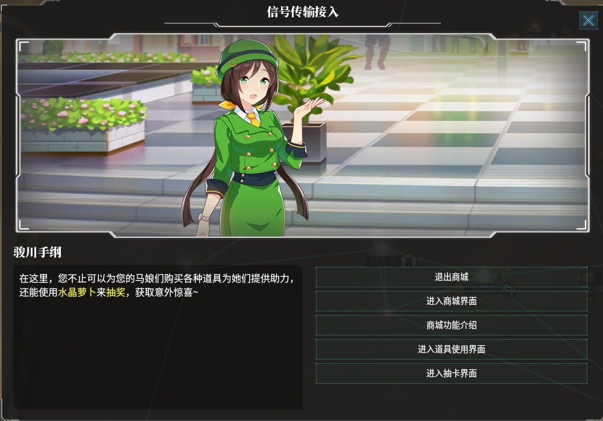

# 马娘商城

> 马娘商城是本mod的独特系统，在控制星系>= 8时触发手纲事件，获得马娘商城通信。

马娘商城主要有两个功能，分别为购买道具和抽奖。

## 道具

点击“进入商城界面”即可购买道具，购买道具需要花费商店币。

商店币的获取途径有以下三种：

法令：举办闪耀系列赛

行星决议：举办星球大赛

商城抽奖概率获得

商城道具每年刷新一次

| 道具         | 描述                                                         | 价格 | 效果                                                         |
| ------------ | ------------------------------------------------------------ | ---- | ------------------------------------------------------------ |
| 巴菲甜点     | 巴菲，是马娘们最喜欢的食物（尤其是某肥驹）。只要一杯超大号巴菲，就能给马娘们带来一天的好心情。 | 30   | 对马娘种族的任意领袖使用，提升一位马娘领袖的心情一档         |
| 蹄铁·极      | 蹄铁，被认为是赛马娘的生命。一块优质的蹄铁，能够为赛马娘的冠军之路提供助力。因此，很多马娘们都将优质的蹄铁当成宝物收藏。 | 55   | 对马娘种族的统治者或总督使用。 若使用对象为统治者：为统治者添加特质“蹄铁·极”，效果持续10年 若使用对象为行政官：为总督添加特质“蹄铁·极”，效果持续10年（此效果不能叠加） |
| 护身符       | 一枚拥有神秘力量的护身符，似乎可以为拥有者抵御灾难、带来好运。 | 55   | 对马娘种族的指挥官使用。 指挥官获得特质“护符的庇佑”，效果持续10年。（此效果不能叠加） 此外，护符或许还能带来意外的好运... |
| 大喇叭       | 神奇的大喇叭，能够发出激昂的声音。听到了这种声音的马娘们，将会变得精力充沛，兴奋无比，一个人能干两个人的活。如果想要进一步地提升喇叭的效果，听说可以让马娘的心上人拿着喇叭对她说“喜欢”... | 75   | 对马娘种族的任意领袖使用。 统治者获得特质“喇叭的激励”,效果持续5年 科学官获得特质“喇叭的激励”，效果持续5年 行政官获得特质“喇叭的激励”，效果持续5年 指挥官获得特质“喇叭的激励”，效果持续5年（此效果不能叠加） |
| 学者帽       | 学者帽，是国内拥有最高智慧的马娘科学家才可以拥有的物品。如果把它戴在头上，似乎突然就聪明起来了。（注：琵琶晨光同学请联系学园后勤部领取特质的加大号学者帽） | 350  | 对马娘种族的统治者、行政官或科学官使用。 统治者获得特质“切者”，特质一直持续。 行政官获得特质“切者”，，特质一直持续。 科学官获得特质“切者”，特质一直持续。（此效果不能叠加） |
| 训练手册     | 一本记载着各种各样的训练方法的手册，马娘们能从其中得到很多启示。 | 120  | 对马娘种族的任意领袖使用。 任意领袖获得特质“训练上手”，特质一直持续。（此效果不能叠加） |
| 醒目的望远镜 | 在很久很久之前，就有训练员在出道战赛场的观众席上，拿着这个望远镜来挖掘明日的顶级赛马娘。同样的，被这个望远镜所注视着的马娘，也将会获得极高的人气。 | 200  | 对马娘种族的任意领袖使用。 统治者获得特质“醒目株”，特质一直持续。 行政官获得特质“醒目株”，特质一直持续。 科学官获得特质“醒目株”,特质一直持续。 指挥官获得特质“醒目株”,特质一直持续。（此效果不能叠加） |
| 马娘的小镜子 | 处于青春期的马娘们很在意自己的外貌，所以她们很喜欢用这种小镜子来梳妆打扮。不过，这面镜子似乎有某种魔力，能够让它的主人变得更可爱。 | 100  | 对马娘种族的统治者和行政官使用。 统治者获得特质“爱娇”，特质一直持续。 行政官获得特质“爱娇”，特质一直持续。（此效果不能叠加） |
| 超大纸杯蛋糕 | 超大号的纸杯蛋糕，超大份的甜点体验。如果不考虑体重问题，没有什么能比纸杯蛋糕更让马娘们开心的了。 | 55   | 对马娘种族的任意领袖使用，提升一位马娘领袖的心情两档         |
| 皇家青汁     | 虽然体力65被认为是最强大的体力恢复剂，但真正的体力恢复药剂之王另有其人——便是这杯皇家青汁。只需要一小杯这种神奇的饮料，便可以让马娘从极度疲劳中完全恢复。然而，其味道...额...并不是很让人恭维。因此，当训练员试图喂马娘青汁的时候，她们往往会遭到强烈的反抗——甚至比打针还可怕。因此，如果要对自己的马娘们使用，请记得用甜点、游乐园约会（或者一场紧张刺激的马儿跳）来回复她们的心情。 | 100  | 对马娘种族的任意领袖使用，降低一位马娘领袖的心情一档。 统治者获得特质“青汁的力量”，效果持续25年。 行政官获得特质“青汁的力量”，效果持续25年。 科学官获得特质“青汁的力量”，效果持续25年。 指挥官获得特质“青汁的力量”，效果持续25年。（不能对心情为绝不调的马娘领袖使用，且此效果不能叠加）" |
| 体力65药剂   | 马娘们作为能量消耗巨大的生物，经常需要补充体力。而这种酸酸甜甜的超大号体力药剂则是马娘们的最爱。 | 80   | 对马娘种族的任意领袖使用。 统治者获得特质“体力65”，效果持续20年。 行政官获得特质“体力65”，效果持续20年。 科学官获得特质“体力65”，效果持续20年。 指挥官获得特质“体力65”，效果持续20年。（此效果不能叠加） |
| 智力秘籍卷轴 | 记载了智力训练方法的奇妙卷轴，能够永久的提升全体马娘的智力。 | 50   | 永久提升国家 物理学研究、工程学研究 和 社会学研究各1%，领袖经验获得速度提升1%。每10层buff还会额外提供5%的科研速度加成（此效果可以叠加） |
| 根性秘籍卷轴 | 记载了根性训练方法的奇妙卷轴，能够永久的提升全体马娘的根性。 | 50   | 永久降低人口住房使用0.5%，提升人口增长速度0.5%，此外，船体值永久提升1%，陆军生命永久增加2%。每10层buff还会额外提供10%的舰船船体值加成（此效果可以叠加） |
| 力量秘籍卷轴 | 记载了力量训练方法的奇妙卷轴，能够永久的提升全体马娘的力量。 | 50   | 永久提升岗位的食物产出、矿物产出各1%，此外，舰船武器伤害永久提升1%，陆军伤害永久增加2%。每10层buff还会额外提供10%的岗位合金产出和消费品产出（此效果可以叠加） |
| 耐力秘籍卷轴 | 记载了耐力训练方法的奇妙卷轴，能够永久的提升全体马娘的耐力。 | 50   | 永久提升舰船护甲和舰船护盾值1.5%，陆军生命永久增加2%。每10层buff还会额外提供每日1%的护甲与护盾的自动恢复（此效果可以叠加） |
| 速度秘籍卷轴 | 记载了速度训练方法的奇妙卷轴，能够永久的提升全体马娘的速度。 | 50   | 永久提升舰船开火速度和亚光速速度1%，全岗位的产出0.25%。每10层buff还会额外提供2.5%的全岗位产出（此效果可以叠加）" |

## 抽奖

每年可以在商城中进行3次抽奖，每次抽奖需要花费150水晶萝卜。

有一部分奖品为特殊奖励，仅可获得一次。

若已经累计20次没有抽出特殊奖励，之后每一次抽奖的出货概率将变为原本的5倍，直到抽到特殊奖励为止。

在每次抽出特殊奖励后，累计次数将重置。

### 普通奖励

| 奖品               | 效果                                                         |
| ------------------ | ------------------------------------------------------------ |
| 50商店币           | 获得50商店币                                                 |
| 100商店币          | 获得100商店币                                                |
| 小型能量块         | 获得3000能量币                                               |
| 超大号胡萝卜汉堡肉 | 获得3000食物                                                 |
| 一块富金属矿石     | 获得3000矿物                                                 |
| 一块合金           | 获得1000合金                                                 |
| 马娘日用品组合     | 获得1000消耗品                                               |
| 一袋水晶萝卜       | 获得500水晶萝卜                                              |
| 三女神古籍         | 获得500三女神知识                                            |
| 资源大礼包         | 获得6000能量币，6000食物，6000矿物，2000消费品，2000合金，1000水晶萝卜，1000三女神知识 |
| 开运道具           | 获得修正“开运道具”，效果：岗位产出资源+5%，人口增长速度+5%，幸福度+5%，持续20年 |
| 赛事运营指南       | 获得修正“赛事运营指南”，效果：赛马娘岗位产出+20%，训练员岗位产出+20%，持续20年 |
| 古老的百科全书     | 获得6个月产出的三种研究点数                                  |
| 一堆古代文物       | 获得20稀有文物                                               |
| 一本舰队战术手册   | 获得修正“舰队战术手册”，效果：舰船武器伤害+20%，舰船武器射程+20%，持续20年 |

### 特殊奖励

| 名称         | 效果                                                         |
| ------------ | ------------------------------------------------------------ |
| 高能能量块   | 获得修正“高能能量块”，效果：每月能量币+20%                   |
| 奇迹工业设备 | 获得修正“奇迹工业设备”，效果：每月合金+15%，每月消费品+15%   |
| 优良胡萝卜种 | 获得修正“优良胡萝卜种”，效果：岗位产生的食物+20%             |
| 万花筒       | 获得修正“万花筒内的世界”，效果：每月物理学研究+10%，每月社会学研究+10%，每月工程学研究+10% |
| 马娘观察日记 | 获得修正“马娘观察日记”，效果：人口增长速度+10%，幸福度+5%，稳定度+3，犯罪度-5 |
| 北部玄驹     | 获得领袖北部玄驹（可自由选择领袖类型），初始等级为6          |
| 神鹰         | 获得领袖神鹰（可自由选择领袖类型），初始等级为6              |
| 圣王光环     | 获得领袖圣王光环（可自由选择领袖类型），初始等级为6          |

